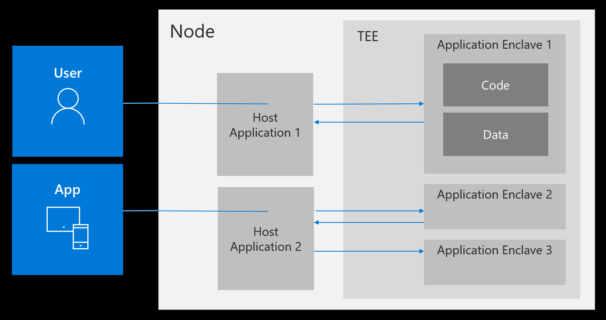

---
# You don't need to edit this file, it's empty on purpose.
# Edit theme's home layout instead if you wanna make some changes
# See: https://jekyllrb.com/docs/themes/#overriding-theme-defaults
layout: default
---
### What is Open Enclave SDK? 

Confidential computing is an ongoing effort to protect data throughout its lifecycle at rest, in transit and now in use.  With the use of Trust Execution Environments, customers can build applications that protect data from outside access while in use. Open Enclave SDK is an open source SDK targeted at creating a single unified enclaving abstraction for developer to be build Trusted Execution Environment (TEEs) based applications.  As TEE technology matures and as different implementations arise, the Open Enclave SDK is committed to supporting an API set that allows developers to build once and deploy on multiple technology platforms, different environments from cloud to hybrid to edge, and for both Linux and Windows.

### Trusted Execution Environment(TEE) Based Application Development

An enclave application partitions itself into two components (1) an untrusted component (called the host) and (2) a trusted component (called the enclave).  The host component runs unmodified on the untrusted operating system, while the trusted component runs within the enclave, the protected container provided by a TEE implementation.  These protections allow enclaves to perform secure computations with assurances that secrets will not be compromised.

### Core Tenets

  
<h4 >Universal</h4>
Generalize enclave application model to minimize hardware/software specific concepts

  
<h4>Pluggable</h4>
Componentization to support desired runtimes and crypto libraries

   
<h4>Standardized</h4>
Remove hardware vendor specific signing and verification requirements

  

   
<h4>Multi-platform</h4>
Design with all software platforms, Windows and Linux, in mind

   
 <h4>Compatible</h4>
Easier enablement of redistributable applications

   
<h4>Open</h4>
Open source and a standard for secure enclave-based application development

### Supported SDK Functionality

  
<h4>&#10004;Enclave creation and management</h4>
Function calls to manage the lifecycle of an enclave within your application

  
<h4>&#10004;Enclave measurement and identity</h4>
Expressions of enclave measurement and identity

  

  
<h4>&#10004;Communication</h4>
Mechanisms for defining call-ins and call-outs and the data marshalling associated with them

  
<h4>&#10004;System primitives</h4>
System primitives exposed by enclave runtime, such as thread and  memory management

<h4>&#10004;Sealing</h4>
Functions to support persistence of secrets

  
<h4>&#10004;Attestation</h4>
Functions to support verification of identity

<h4>&#10004;Runtime and cryptographic libraries</h4>
Pluggable libraries to provide the necessary language and cryptographic support within an enclave

### New Features in Current Version
With release 0.4, we are excited to provide support for: 
* Operating System: Linux
* Trusted Execution Environments: Intel SGX 
* Runtime Libraries: C/C++ 
* Cryptographic Libraries: mBedTLS. 

Coming soon: Arm TrustZone support in Linux and both Intel SGX and TrustZone support in Windows!
